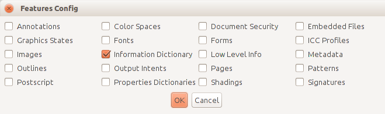

*Brief*
A more detailed report (7-8 pages max) that explains to people working at memory institutions what is your tool about, how to install and run it, how to define preservation policies using the tool and how to read and interpret the reports to address the issues that have been identified in the collections. Figures/pictures/diagrams/photos are well appreciated too.

Introduction
------------

Introducing veraPDF
-------------------
Designed to meet the needs of digital preservationists, and supported by leading members of the PDF software developer community, veraPDF is a purpose-built, open source, permissively licensed file-format validator covering all PDF/A parts and conformance levels.

veraPDF can be installed on Windows, Mac, and Linux machines, providing  command line and GUI software that can:

- analyse PDF/A documents and report conformance to any PDF/A part and conformance level;
- perform basic repairs upon PDF/A metadata so that a document complies with the PDF/A specification;
- extract metadata about the structure of a PDF document and it's contents, e.g. the fonts, image formats used in a document; and
- carry out user-defined checks on PDF documents to ensure that they comply with local institutional policy.

Installing veraPDF
------------------
You can get the latest version of the veraPDF installer here: http://software.verapdf.org/release/verapdf-installer.zip. The installer package is a zip file that contains:

- the Java installer and application as a single jar file,
  `verapdf-izpack-installer-<version>.jar`;
- a Windows batch file that runs the installer, `vera-install.bat`;
- a bash script that executes the installer on Linux or Mac OS machines,
  `vera-install.sh`.

The installer jar file includes the application binary files and supplementary resources, including:

- Validation Model description;
- test PDF Documents; and
- the veraPDF Validation Profiles.

If you run the installer you'll be greeted with the following screen:

It's safe to follow the defaults, more information about the installation process is available at http://docs.verapdf.org/download/.

Validating PDF/A Files with the GUI
-----------------------------------
The veraPDF GUI provides the features of veraPDF PDF/A Java Library in a desktop windows GUI. Users can configure their own PDF/A validation and policy checking jobs by selecting:
- which combination of tasks to perform;
- PDF Documents to analyse;
- the PDF/A part and conformance level to test for; and
- various task specific settings.

The software carries out the configured task and reports the results in both XML and HTML formats. The XML report is intended for consumption by automated processes while the HTML report is designed for human readablilty.

The quickest and easiest way to use the software is to run the GUI application that you can install following the instructions above.

### Starting the application
You can start the GUI application by executing a script within the application installation folder. Depending on your Operating System you'll need:

- for Mac OSX, Linux and Unix users: `verapdf-gui`
- on Windows users: `verapdf-gui.bat`

If all is well you'll see this window:

### Validating PDF/A documents
The "PDF/A flavour" dropdown is used to control validation processing. The user can:
- select any of the built in PDF/A Validation Profiles;
- allowing the software to select a Validation Profile by analysing the PDF/A document metadata; or
- choose to load a custom Validation Profile from their filesystem.
Leaving "Auto-detection" enabled is usually the best bet unless you want to enforce a particular PDF/A flavour for validation.

The "Report type" dropdown controls which validation processes are run, we're only executing "Validation". Pressing the "Choose PDF" button opens a file selection dialog so you can select the files and directories you want to process. Once you've made your selection the "Execute" button, a progress bar will appear. After validation is complete a summary of the result is shown:

You can use the "Report" buttons at the bottom of the window to view or save the generated report in HTML or XML formats. Here we show a part of the HTML report:

Feature Extraction & Policy Checking
------------------------------------
Sometimes you'll need to got a bit further than PDF/A Validation. Maybe you want know a bit more about the metadata within a document. Alternatively you or your organisation might want to enforce a different set of criteria than those use in validation.

Because memory institutions have quite specific and sometime strict requirments, the veraPDF software supports two features designed to help them perform effective quality assurance for the material they preserve:

- Feature Extraction : this uses the built in parser to extract information about a PDF Document and its contents;
- Policy Checking : the Policy Checker performs user defined checks on the features of a PDF Document allowing users to enforce local policy.

Here we'll show an example that combines these two features to make some simple checks on a PDF document's metadata. First we'll need to ensure that we've told the software about the information we want.

### Configuration
Using the "Configs->Features Config" menu item we can select the features we want to extract. In this case we're interested in the PDF Information Dictionary metadata:

### Create a policy file
Next we need to create a policy file via the "Configs->Policy Config" menu item.

Interpretting the Output
------------------------
